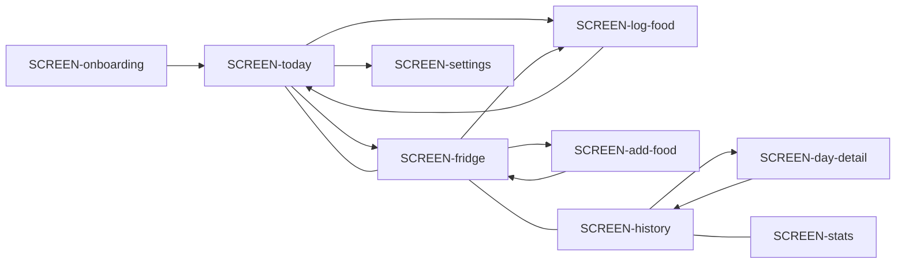

# Navigation Map (durable UI memory)

## Guards and redirects

| Route | Guard | Where it sends on denial |
|-------|-------|--------------------------|
| App shell / tabs | `goals != null` | → SCREEN-onboarding |
| SCREEN-onboarding | first launch / cleared storage | stays until goals saved → shell tab `home` |
| SCREEN-settings | `goals != null` | unreachable without shell |

## Transition edges

- SCREEN-onboarding → SCREEN-today : goals saved (`setGoals`)
- SCREEN-today → SCREEN-fridge : Add food (`setTab('fridge')`)
- SCREEN-today → SCREEN-settings : Settings gear
- SCREEN-today → SCREEN-log-food : edit entry
- SCREEN-fridge → SCREEN-log-food : select food
- SCREEN-fridge → SCREEN-add-food : Add food / Duplicate
- SCREEN-log-food → SCREEN-today : confirm log/update
- SCREEN-add-food → SCREEN-fridge : save food
- SCREEN-history → SCREEN-day-detail : select past day
- SCREEN-day-detail → SCREEN-history : dismiss
- SCREEN-settings → SCREEN-today (shell) : Save / Cancel
- SCREEN-app-shell tab switches : home ↔ fridge ↔ history ↔ stats (BottomNav)

## Graph (Mermaid, optional)

